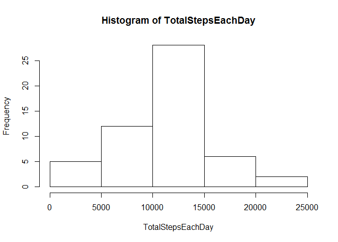
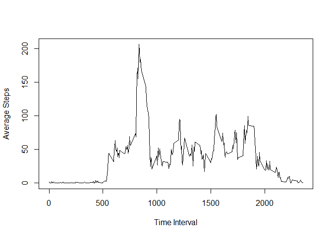
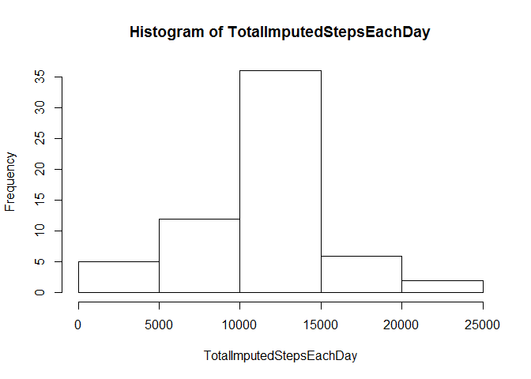
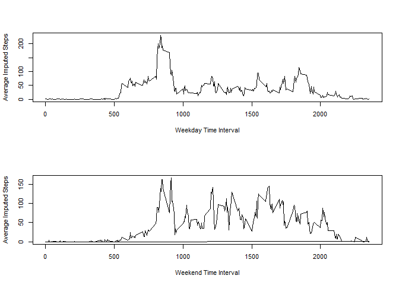

#    Reproducible Research Peer Assessment I
##   LMforCoursera
##   November 13,2015

This is an R Markdown document for analyzing and presenting results from the
data for Peer Assessment I in the Coursera class Reproducible Research. The
output will be an html file.

First, read the data into a dataframe. Then remove rows that have step values of NA.


```r
   activitydata <- read.csv("C:/Users/Matthew/Documents/Lucia/CourseraR/RepData_PeerAssessment1-1/activity.csv", header=TRUE, colClasses = c("numeric", "Date", "integer"))
   actualsteps <- activitydata[!is.na(activitydata[,1]),]
```

Calculate the total number of steps taken each day and make a histogram.


```r
   TotalStepsEachDay <- tapply(actualsteps$steps, actualsteps$date, sum)
   hist(TotalStepsEachDay)
```

 

Calculate and display the mean and median of the total number of steps taken each day.


```r
   print(paste("The mean of TotalStepsEachDay is", mean(TotalStepsEachDay)))
```

```
## [1] "The mean of TotalStepsEachDay is 10766.1886792453"
```

```r
   print(paste("The median of TotalStepsEachDay is",
               median(TotalStepsEachDay)))
```

```
## [1] "The median of TotalStepsEachDay is 10765"
```

Calculate the average number of steps taken in a time interval averaged across all days. Make a time series plot. Identify the time interval with the maximum average number of steps.


```r
   TimeIntervalSteps <- cbind(actualsteps[,3],actualsteps[,1])
   TimeIntervalAverageSteps <- aggregate(TimeIntervalSteps[,2],
                                         list(TimeIntervalSteps[,1]),mean)
   AverageStepsTimeSeries <- ts(TimeIntervalAverageSteps)
   plot(AverageStepsTimeSeries[,1], AverageStepsTimeSeries[,2], type = "l",
       xlab = "Time Interval", ylab = "Average Steps")
```

 

```r
   MaxSteps <- TimeIntervalAverageSteps[which.max(TimeIntervalAverageSteps[,2]),]
   print(paste("The time interval for the maximum # of steps is:", MaxSteps[1,1]))
```

```
## [1] "The time interval for the maximum # of steps is: 835"
```

```r
   print(paste("The average value for the maximum # of steps is:", MaxSteps[1,2]))
```

```
## [1] "The average value for the maximum # of steps is: 206.169811320755"
```

Calculate and report the total number of missing values in this dataset.


```r
   NASteps <- activitydata[is.na(activitydata),1]
   print(paste("The total number of missing values is", length(NASteps)))
```

```
## [1] "The total number of missing values is 2304"
```

Looking at the original set of data, in rows where the step value is NA, replace the step value with the average number of steps for the same time interval.


```r
   ImputedSteps <- activitydata
   for (i in 1:17568) {
     if (is.na(activitydata[i,1])) {
       TimeInterval <- activitydata[i,3]
       AverageSteps <- 
         TimeIntervalAverageSteps[which(TimeIntervalAverageSteps[,1]==TimeInterval),2]
       ImputedSteps[i,1] <- AverageSteps
     }
   }
```

Make a histogram of the total number of steps taken each day from the ImputedSteps dataset. Report the mean and the median.


```r
   TotalImputedStepsEachDay <- tapply(ImputedSteps$steps, ImputedSteps$date, sum)
   hist(TotalImputedStepsEachDay)
```

 

```r
   print(paste("The mean of TotalImputedStepsEachDay is", mean(TotalImputedStepsEachDay)))
```

```
## [1] "The mean of TotalImputedStepsEachDay is 10766.1886792453"
```

```r
   print(paste("The median of TotalImputedStepsEachDay is",
               median(TotalImputedStepsEachDay)))
```

```
## [1] "The median of TotalImputedStepsEachDay is 10766.1886792453"
```

The mean of total steps taken each day calculated for the dataset with imputed values is the same as the mean for the original data. The median calculated for the dataset with imputed values is the same as the mean, While the median for the original dataset is an integer less than 0.012% different from the mean. So there is essentially no impact from imputing numbers this way for the missing data.

Now let's use the dataset with imputed values to examine whether activity as measured by steps differs between weekdays and weekends. First add a column to ImputedSteps, specifying whether the date is a weekday or a weekend.


```r
   WeekdayORWeekend <- weekdays(ImputedSteps[,2])
   WeekdayORWeekend[which(WeekdayORWeekend == "Sunday")] <- "Weekend"
   WeekdayORWeekend[which(WeekdayORWeekend == "Monday")] <- "Weekday" 
   WeekdayORWeekend[which(WeekdayORWeekend == "Tuesday")] <- "Weekday"
   WeekdayORWeekend[which(WeekdayORWeekend == "Wednesday")] <- "Weekday"
   WeekdayORWeekend[which(WeekdayORWeekend == "Thursday")] <- "Weekday"
   WeekdayORWeekend[which(WeekdayORWeekend == "Friday")] <- "Weekday"
   WeekdayORWeekend[which(WeekdayORWeekend == "Saturday")] <- "Weekend" 
   ImputedSteps <- cbind(ImputedSteps, WeekdayORWeekend)
```

Make separate time series plots of steps taken in each time interval for weekdays and weekends. Still working on this . . .


```r
   TimeIntervalImputedSteps <- cbind(ImputedSteps[,4],ImputedSteps[,3], ImputedSteps[,1])
   TimeIntervalAverageImputedSteps <- aggregate(TimeIntervalImputedSteps[,3],
                  list(TimeIntervalImputedSteps[,2], TimeIntervalImputedSteps[,1]),mean)
   WeekdayAverageImputedStepsTimeSeries <- ts(TimeIntervalAverageImputedSteps[1:288,])
   WeekendAverageImputedStepsTimeSeries <- ts(TimeIntervalAverageImputedSteps[288:576,])
   par(mfrow=c(2,1), cex=0.7)
   plot(WeekdayAverageImputedStepsTimeSeries[,1], WeekdayAverageImputedStepsTimeSeries[,3],
        type = "l", xlab = "Weekday Time Interval", ylab = "Average Imputed Steps")
   plot(WeekendAverageImputedStepsTimeSeries[,1], WeekendAverageImputedStepsTimeSeries[,3],
        type = "l", xlab = "Weekend Time Interval", ylab = "Average Imputed Steps")
```

 

